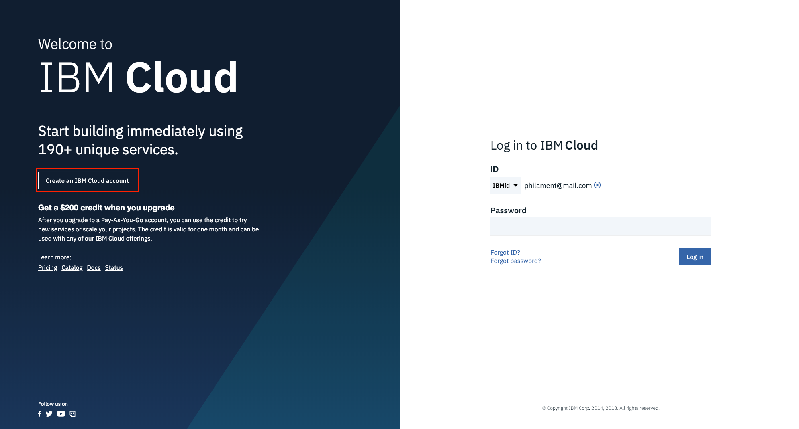
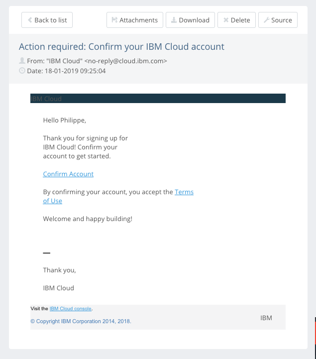
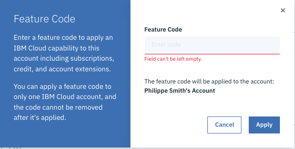
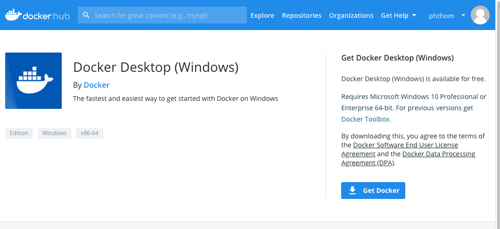

# Practical Container Orchestration 
---
# Preparing the labs
---


## Table of Contents

- [Task 1. IBM Cloud registration](#task-1-ibm-cloud-registration)
    + [Sign in to IBM Cloud](#sign-in-to-ibm-cloud)
    + [Fill in the form](#fill-in-the-form)
    + [Confirm your registration to IBM Cloud from your inbox](#confirm-your-registration-to-ibm-cloud-from-your-inbox)
- [Task 2. Apply a promo code (if necessary)](#task-2-apply-a-promo-code--if-necessary-)
- [Task 3. Install Docker CE on your Mac](#task-3-install-docker-ce-on-your-mac)
- [Task 4. Install Docker CE on Windows](#task-4-install-docker-ce-on-windows)
- [Task 5. Install Git on your laptop](#task-5-install-git-on-your-laptop)
- [Task 6. Install the ibmcloud (ic) command](#task-6-install-the-ibmcloud--ic--command)
- [Task 7. Login to IBM Cloud](#task-7-login-to-ibm-cloud)
- [Task 8. Conclusion](#task-8-conclusion)
    + [Results](#results)

Before you can run all the labs about container orchestration, you should prepare your environment to execute those labs.


# Task 1. IBM Cloud registration

Labs are running on the **IBM Cloud** (ex Bluemix).

So before you can start any labs, you should have satisfied the following prerequisites :
- [ ] You should have **1 valid email** 
- [ ] Sign up to the **IBM Cloud** 


> If you don't have a valid email address or you don't want to use your personal or professional email address, then you can use https://temp-mail.org/en/

This web site will give you a temporary email address for 10 minutes :


From that screen,  you can use this temporaty email address (cugebezaza@utooemail.com for example) for the time to register to the IBM Cloud. 

### Sign in to IBM Cloud
If you don't have already registered to **IBM Cloud**,  
Open this link  [IBM Cloud](https://cloud.ibm.com/) or type https://cloud.ibm.com/ in your favorite internet browser.




### Fill in the form
Specify last name, first name, country, phone number and password.
> By **default**, all new people that register to IBM Cloud will have an **Lite Account** with **no time restriction**. This is not a 30 day trial account. 

Click on **Create Account** button.

 


Then if everything is fine, you will receive the following page:


### Confirm your registration to IBM Cloud from your inbox
From your email application , you should have received an email from the IBM Cloud:


Click on the link to confirm the account:



Log in to IBM Cloud with your credentials :


Then type your password and click **Continue**


Type your password and click Login button:


You should see the following **Dashboard**:


You are now connected (and registred) to the IBM Cloud.

> IMPORTANT : Take a note of your email address and your password.


# Task 2. Apply a promo code (if necessary)

Check if you can access to **Containers in Kubernetes Clusters**.
To do so, click on **Catalog** and click on **Containers** on the left pane of the page :


> **IMPORTANT** : If you just see **Container Registry** and not the Containers in Kubernetes Clusters, then **you will need a promo code !!!**

> **IMPORTANT** : If you don't have a **promo code**, then ask IBM during the workshop. You can continue the other steps of this preparation and come back later to this step. However, to create a cluster, you will need a promo code.

To install a promo code, follow the procedure : 

Go to **Manage >Account > Account Settings** and press enter.


You should get the following section in the **account setting page**  :


Click **Apply Code** button.




Enter your **promo code** and click **Apply** 


> Close this window and **logout / login** to your account.

Go back to the **Catalog** and check that now you have access to **Containers in Kubernetes Clusters** and the Container Registry.


# Task 3. Install Docker Desktop on your Mac

Follow this procedure to install the latest Docker Desktop (ex Community Edition) on your Mac (**for Windows**, jump to the next session) 

Docker Desktop for Mac is favailable for free.

https://store.docker.com/editions/community/docker-ce-desktop-mac


Click on the blue button **Please Login to Download**. If you are not registred to the Docker site, then create an account. Then when you are registered and logged in, click on the **Get Docker ** button.


Double-click **Docker.dmg** to start the install process.

When the installation completes and Docker starts, the whale in the top status bar shows that Docker is running, and accessible from a terminal.


Open a terminal and type :

`docker version`

You should see something similar to this screen :
```console
> docker version
Client: Docker Engine - Community
 Version:           18.09.1
 API version:       1.39
 Go version:        go1.10.6
 Git commit:        4c52b90
 Built:             Wed Jan  9 19:33:12 2019
 OS/Arch:           darwin/amd64
 Experimental:      false

Server: Docker Engine - Community
 Engine:
  Version:          18.09.1
  API version:      1.39 (minimum version 1.12)
  Go version:       go1.10.6
  Git commit:       4c52b90
  Built:            Wed Jan  9 19:41:49 2019
  OS/Arch:          linux/amd64
  Experimental:     true

```
> Note that you should always have the client and the server running.

> The Docker server contains the **Docker engine**(containerd) that controls running containers. 


# Task 4. Install Docker Desktop on Windows

Follow this procedure to install the latest Docker Desktop (ex Community Edition) on Windows (for Mac, jump to the previous session) 

Docker Desktop for Windows is available for free.

https://store.docker.com/editions/community/docker-ce-desktop-windows


Click on the blue button **Please Login to Download**. If you are **not** registred to the Docker site, then create an account. Then when you are registered and logged in, click on the **Get Docker ** button.



Leave the default parameters: 


After download, install Docker Desktop:

**Double-click Docker for Windows Installer** to run the installer.

> **IMPORTANT**: During the installation process, you may be informed the installer will reboot your workstation to install the virtualization feature of your PC. 


When the installation finishes, Docker starts automatically. The **whale** in the notification area indicates that Docker is running, and accessible from a terminal.

Open a command-line terminal like PowerShell, and try out some Docker commands!

Run docker version to check the version.

`docker version`

You should see something similar to this screen :
```console
> docker version
Client: Docker Engine - Community
 Version:           18.09.1
 API version:       1.39
 Go version:        go1.10.6
 Git commit:        4c52b90
 Built:             Wed Jan  9 19:33:12 2019
 OS/Arch:           darwin/amd64
 Experimental:      false

Server: Docker Engine - Community
 Engine:
  Version:          18.09.1
  API version:      1.39 (minimum version 1.12)
  Go version:       go1.10.6
  Git commit:       4c52b90
  Built:            Wed Jan  9 19:41:49 2019
  OS/Arch:          linux/amd64
  Experimental:     true
```
> Note that you should always have the client and the server running.

> The Docker server contains the **Docker engine** (containerd) that controls running containers. 

# Task 5. Install Git on your laptop

To do so : 

For MacOS :
http://mac.github.com

For Windows: 
http://git-scm.com/download/win

At some point during the installation, change to the **"Use Windows default console"** and continue the installation.


# Task 6. Install the ibmcloud command

The **ibmcloud** command line interface (CLI) provides a set of commands that are grouped by namespace for users to interact with IBM Cloud. In previous versions, the name of that command was "bluemix" or "bx".

You install a set of IBM® Cloud developer tools, verify the installation, and configure your environment. IBM® Cloud developer tools offer a command-line approach to creating, developing, and deploying end-to-end web, mobile, and microservice applications.

With this installation, you get the stand-alone IBM Cloud CLI, plus the following tools:

Homebrew (Mac only)
Git
Docker
Helm
kubectl
curl
IBM Cloud Developer Tools plug-in
IBM Cloud Functions plug-in
IBM Cloud Container Registry plug-in
IBM Cloud Kubernetes Service plug-in
sdk-gen plug-in

For MacOS or Linux (run as root) :
`curl -sL https://ibm.biz/idt-installer | bash`

For Windows in PowerShell (run as Administrator - your system will be rebooted at the end of installation) : 

```
Set-ExecutionPolicy Unrestricted; iex(New-Object Net.WebClient).DownloadString('http://ibm.biz/idt-win-installer')
```

Results:

```console
> curl -sL https://ibm.biz/idt-installer | bash
[main] --==[ IBM Cloud Developer Tools for Linux/MacOS - Installer, v1.2.3 ]==--
[install] Starting Installation...
[install] Note: You may be prompted for your 'sudo' password during install.
[install_darwin_deps] Checking for external dependency: brew
[install_darwin_deps] Installing/updating external dependency: git
[install_darwin_deps] Installing/updating external dependency: docker
[install_darwin_deps] Installing/updating external dependency: kubectl
[install_darwin_deps] Installing/updating external dependency: helm
[install_bx] Updating existing IBM Cloud 'bx' CLI...
Checking for updates...
New version 0.13.1 is available.
Release notes: https://github.com/IBM-Cloud/bluemix-cli-release/releases/tag/v0.13.1

Do you want to update now? [Y/n]> 
FAILED
Could not read from input: EOF

[install_bx] Running 'bx --version'...
bx version 0.12.1+a6d7092-2018-11-19T10:31:10+00:00
[install_plugins] Installing/updating IBM Cloud CLI plugins used by IDT...
[install_plugins] Checking status of plugin: cloud-functions
[install_plugins] Installing plugin 'cloud-functions'
Looking up 'cloud-functions' from repository 'IBM Cloud'...
Plug-in 'cloud-functions 1.0.27' found in repository 'IBM Cloud'
Attempting to download the binary file...
 11.55 MiB / 11.55 MiB [=============================================================================================================] 100.00% 4s
12110032 bytes downloaded
Installing binary...
OK
Plug-in 'cloud-functions 1.0.27' was successfully installed into /Users/phil/.bluemix/plugins/cloud-functions. Use 'bx plugin show cloud-functions' to show its details.
[install_plugins] Checking status of plugin: container-registry
[install_plugins] Updating plugin 'container-registry' from version '0.1.347'
Plug-in 'container-registry 0.1.347' was installed.
Checking upgrades for plug-in 'container-registry' from repository 'IBM Cloud'...
No updates are available.
[install_plugins] Checking status of plugin: container-service
[install_plugins] Installing plugin 'container-service'
Looking up 'container-service' from repository 'IBM Cloud'...
Plug-in 'container-service/kubernetes-service 0.2.19' found in repository 'IBM Cloud'
Attempting to download the binary file...
 22.77 MiB / 22.77 MiB [=============================================================================================================] 100.00% 8s
23876968 bytes downloaded
Installing binary...
OK
Plug-in 'container-service 0.2.19' was successfully installed into /Users/phil/.bluemix/plugins/container-service. Use 'bx plugin show container-service' to show its details.
[install_plugins] Checking status of plugin: dev
[install_plugins] Updating plugin 'dev' from version '2.1.12'
Plug-in 'dev 2.1.12' was installed.
Checking upgrades for plug-in 'dev' from repository 'IBM Cloud'...
No updates are available.
[install_plugins] Checking status of plugin: sdk-gen
[install_plugins] Updating plugin 'sdk-gen' from version '0.1.12'
Plug-in 'sdk-gen 0.1.12' was installed.
Checking upgrades for plug-in 'sdk-gen' from repository 'IBM Cloud'...
No updates are available.
[install_plugins] Running 'bx plugin list'...
Listing installed plug-ins...

Plugin Name                            Version   Status   
container-service/kubernetes-service   0.2.19       
dev                                    2.1.12       
icp                                    2.1.284      
schematics                             1.2.0        
sdk-gen                                0.1.12       
cloud-functions/wsk/functions/fn       1.0.27       
container-registry                     0.1.347 

[install_plugins] Finished installing/updating plugins
[install] Install finished.
[main] --==[ Total time: 46 seconds ]==--

```

To verify that the CLI and developer tools were installed successfully, run the help command:

`ibmcloud dev help`

Results:

```console
ibmcloud dev help
NAME:
   ibmcloud dev - A CLI plugin to create, manage, and run applications on IBM Cloud

USAGE:
   ibmcloud dev command [arguments...] [command options]

VERSION:
   2.1.4

COMMANDS:
   build             Build the application in a local container
   code              Download the code from an application
   console           Opens the IBM Cloud console for an application
   create            Creates a new application and gives you the option to add services
   diag              This command displays version information about installed dependencies
   debug             Debug your application in a local container
   delete            Deletes an application from your space
   deploy            Deploy an application to IBM Cloud
   edit              Add or remove services for your application
   enable            Add IBM Cloud files to an existing application.
   get-credentials   Gets credentials required by the application to enable use of connected services.
   list              List all IBM Cloud applications in a space
   run               Run your application in a local container
   shell             Open a shell into a local container
   status            Check the status of the containers used by the CLI
   stop              Stop a container
   test              Test your application in a local container
   view              View the URL of your application
   help              Show help
   
Enter 'ibmcloud dev help [command]' for more information about a command.

GLOBAL OPTIONS:
   --version, -v                  Print the version
   --help, -h                     Show help

```

You can also verify your CLI installation by typing:

`ibmcloud plugin list` 

Results:

```console
ibmcloud plugin list
Listing installed plug-ins...

Plugin Name                            Version   
container-registry                     0.1.339   
container-service/kubernetes-service   0.1.581   
dev                                    2.1.4   
icp                                    2.1.284   
schematics                             1.2.0   
sdk-gen                                0.1.12   
IBM-Containers                         1.0.1058   
cloud-functions/wsk/functions/fn       1.0.22 
```


# Task 7. Login to IBM Cloud

For these labs, we have decided to login to the **London Data Center** (api.eu-gb.bluemix.net). 

Login to IBM Cloud with the ic command :

 `ibmcloud login -a api.eu-gb.bluemix.net`

 And answer a few questions: email, password :

```console
> ibmcloud login -a api.eu-gb.bluemix.net
API endpoint: api.eu-gb.bluemix.net

Email> cugebezaza@utooemail.com

Password> 
Authenticating...
Credentials were rejected.
Code: BXNIM0602E, message: The credentials you entered for the user 'cugebezaza@utooemail.com' are incorrect

Password> 
Authenticating...
OK

Targeted account Philippe Smith's Account (828b1270b40247a897d94167c14051bc)

Targeted resource group Default

                      
API endpoint:      https://api.eu-gb.bluemix.net   
Region:            eu-gb   
User:              cugebezaza@utooemail.com   
Account:           Philippe Smith's Account (828b1270b40247a897d94167c14051bc)   
Resource group:    Default   
CF API endpoint:      
Org:                  
Space:                

Tip: If you are managing Cloud Foundry applications and services
- Use 'ibmcloud target --cf' to target Cloud Foundry org/space interactively, or use 'ibmcloud target --cf-api ENDPOINT -o ORG -s SPACE' to target the org/space.
- Use 'ibmcloud cf' if you want to run the Cloud Foundry CLI with current IBM Cloud CLI context.

```


And optionally, you can also specify the following ORG and SPACE with that command :

`ic target -o cugebezaza@utooemail.com -s dev`

Results:

 ```console 
> ic target -o cugebezaza@utooemail.com -s dev
Targeted Cloud Foundry (https://api.eu-gb.bluemix.net)

Targeted org cugebezaza@utooemail.com

Targeted space dev
                      
API endpoint:      https://api.eu-gb.bluemix.net   
Region:            eu-gb   
User:              cugebezaza@utooemail.com   
Account:           Philippe Smith's Account (828b1270b40247a897d94167c14051bc)   
Resource group:    Default   
CF API endpoint:   https://api.eu-gb.bluemix.net (API version: 2.106.0)   
Org:               cugebezaza@utooemail.com   
Space:             dev   

 ```


# Task 8. Conclusion

###  Results
<span style="background-color:yellow;">Successful exercise ! </span>
You finally went thru the following features :
- [x] You registered to IBM Cloud
- [x] You applied a promo code
- [x] You installed Docker on your laptop
- [x] You installed Git
- [x] You installed the ic command
- [x] You login to IBM Cloud successfully
- [x] You are ready for the labs
---
# End of the lab
---
# Practical Container Orchestration 
---
